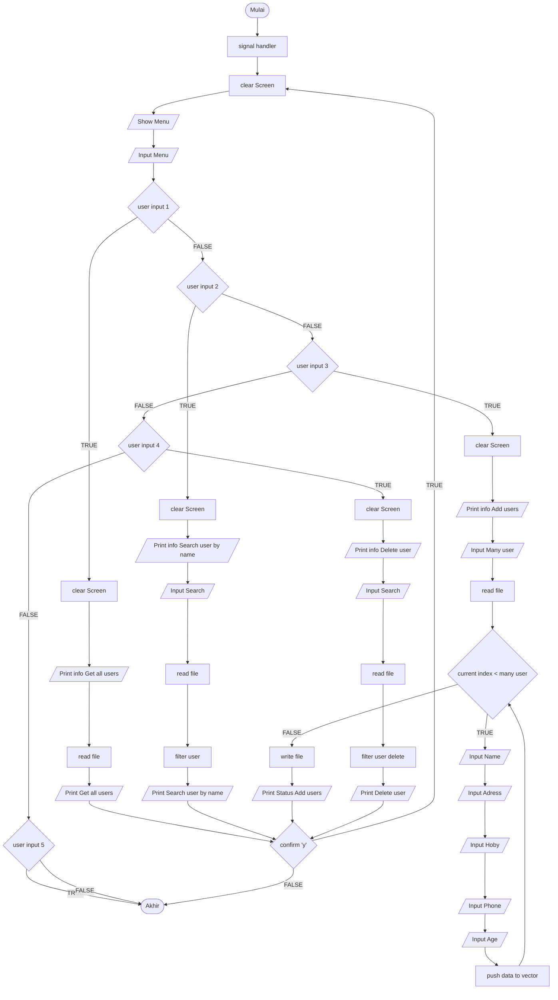

<h1 align="center" style="margin-bottom:0">UsDa Apps - (User Database)</h1>

Created by <a href="https://github.com/rizalarfiyan/" target="_blank">Rizal Arfiyan</a> by &#10084;
 

UsDa Apps adalah sebuah mini program create read delete user yang di simpan dalam file csv. Proyek ini digunakan untuk memenuhi tugas UAS matkul Algoritma dan Pemrograman yang diampu oleh ibu Wiwi Widayani, M.Kom.

## Flow Chart
